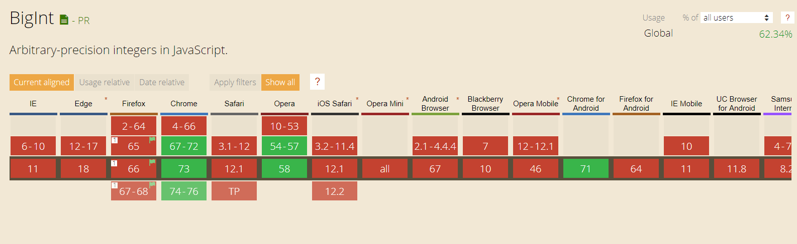
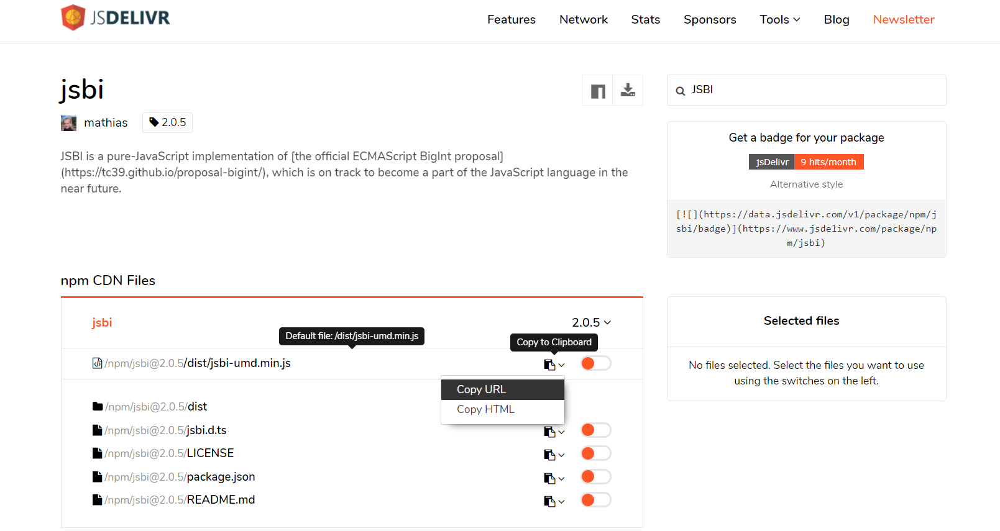

# Handle Big Int in JavaScript

在 JavaScript 中运算比较大的 Number 类型时，会碰到如下问题：

```javascript
const myNumb = 1000000000000000000000;
myNumb + 1 === myNumb; // 加没加竟然一样。。。
```

造成这个问题的原因是当 Number 超过 `Number.MAX_SAFE_INTEGER` 后，会损失精度。

Big Int 丢失精度问题在银行等系统中会碰到，以前的解决方法是引用其他库来做运算。Google 在 V8 引擎中内置了 BigInt 类型来解决 Big Int 丢失精度问题。

## 以前的解决方案

许多库使用 String 来存储大数来解决这个问题，如 `bignum.js`。但是，这些库效率没有 BigInt 高。

## BigInt 的解决方案

### 在提供 BigInt 的宿主中使用

Chrome 等浏览器中引入了 BigInt 类型来解决大数问题。

创建 BigInt 的两种方式：

```javascript
// 1. Use BigInt()
var a = BigInt(123); // 123n

// 2. Add suffix n
var b = 123n; // 123n

typeof a; // bigint
typeof b; // bigint
```

使用 BigInt 进行运算：

```javascript
1234567890123456789 * 123; // 151851850485185200000 损失精度

1234567890123456789n * 123n; // 151851850485185185047n 精度无损失
```

### 在不提供 BigInt 的宿主中使用



通过查询 [Can-I-Use](https://caniuse.com/#search=BigInt) ,发现这个解决方案在大部分浏览器不适用。

在不支持 BigInt 的浏览器上，可以 Polyfilling and transpiling BigInts。由于 BigInt 的特殊性，BigInt 跟普通的 Polyfilling 不一样，BigInt 的代码不能转化为 ES5 标准。使用 Google 开发的 JSBI 库,能在各个浏览器中使用 BigInt。

```javascript
// 使用JSBI库
import JSBI from "./jsbi.mjs";

const max = JSBI.BigInt(Number.MAX_SAFE_INTEGER);
console.log(String(max));
// → '9007199254740991'
const other = JSBI.BigInt("2");
const result = JSBI.add(max, other);
console.log(String(result));
// → '9007199254740993'
```

如果需要直接在浏览器能使用，也可以引用 `<script src="https://cdn.jsdelivr.net/npm/jsbi@2.0.5/dist/jsbi-umd.min.js"></script>` 脚本。

寻找这个脚本的方法如下：

1. Get to [cdn](https://www.jsdelivr.com/)
2. Search "JSBI", and get to [jsbi](https://www.jsdelivr.com/package/npm/jsbi)
3. Copy the jsbi cdn url

   

## 参考文献

- [arbitrary-precision integers in JavaScript](https://developers.google.com/web/updates/2018/05/bigint): 讲解了 BigInt 在 V8 引擎上的使用。
