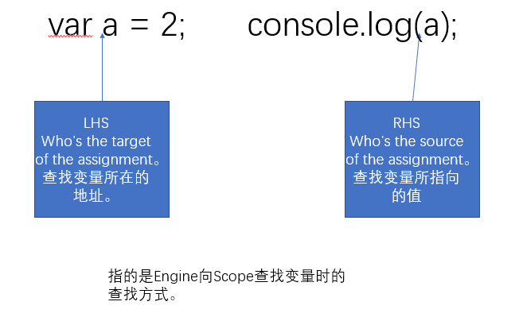

# 函数的执行

## 构建函数的 8 种方式

首先复习一下函数的定义方式。函数的定义方式总共有 8 种：

- 普通 function

  ```javascript
  function foo() {
    // code
  }
  ```

- 箭头函数

  ```javascript
  const foo = () => {
    // code
  };
  ```

- 生成器函数

  ```javascript
  function foo*(){
    // code
  }
  ```

- class 中定义的函数

  ```javascript
  class C {
    foo() {
      //code
    }
  }
  ```

- class 定义的类作为函数

  ```javascript
  class Foo {
    constructor() {
      //code
    }
  }
  ```

- async 修饰的普通/箭头/生成器函数

  ```javascript
  async function foo(){
    // code
  }

  const foo = async () => {
    // code
  }

  async function foo*(){
    // code
  }
  ```

以上 8 种函数的定义方式对普通变量（`var` 或 `let/const` 定义的变量）运行时来说没有多大区别，都遵**继承定义时环境**的规则。

但是，this 关键字比较特殊，它是**由运行时决定的**。

## 函数的执行过程


函数的执行过程涉及环境部分和函数本身。

- 环境部分：指函数是在哪种环境下被调用的，它内部的变量是怎么定义的。普通变量和 this 处理方式不同。
- 函数本身：包含函数本身的执行逻辑。

### 闭包(Closure)就是绑定了执行环境的函数

闭包的广义定义：一种包含环境部分的 λ 表达式。

在 JavaScript 中，闭包的狭义定义：当内部函数是在定义它的词法作用域之外（外部函数）执行，仍然可以记住并访问它所在的词法作用域，这时就产生了闭包。即一个函数在它定义的词法作用域之外被调用，就是闭包。

从闭包的广义定义可以知道，JavaScript 中的函数完全符合闭包的定义。它的环境部分是函数词法环境部分组成，它的标识符列表是函数中用到的未声明变量，它的表达式部分就是函数体。闭包其实就是一小部分 JavaScript 函数，JavaScript 函数的范围比闭包广。闭包是绑定了执行环境的函数。包含:

1. 环境部分
   1. 环境: 对应 JavaScript 函数中的词法环境和变量环境(执行上下文的一部分)
   2. 标识符列表: 对应 JavaScript 函数中用到的在该函数外声明的变量
2. 表达式部分: 对应 JavaScript 函数中的函数体，也就是执行逻辑

### 执行上下文

JavaScript 标准把一段代码（包括函数），执行所需的所有信息定义为：“执行上下文”。

在 ES3 中，执行上下文包含三个部分:

- scope：作用域，也常常被叫做**作用域链**。
- variable object：变量对象，用于存储变量的对象。
- this value：this 值。

在 ES5 中，我们改进了命名方式，把执行上下文最初的三个部分改为下面这个样子:

- lexical environment：词法环境，当获取变量时使用。
- variable environment：变量环境，当声明变量时使用。
- this value：this 值。

在 ES2018 中，扩展为:

- **lexical environment**：**词法环境**，当获取变量或者 this 值时使用。
- **variable environment**：**变量环境**，当声明变量时使用。
- code evaluation state：用于恢复代码执行位置。
- Function：执行的任务是函数时使用，表示正在被执行的函数。
- ScriptOrModule：执行的任务是脚本或者模块时使用，表示正在被执行的代码。
- Realm：使用的基础库和内置对象实例。
- Generator：仅生成器上下文有这个属性，表示当前生成器。

词法环境在获取变量或者 this 值时使用，变量环境在声明变量时使用。变量环境和词法环境的初始值是一样的，随着函数执行，变量环境始终不变，词法环境会发生改变。

### 函数中 var 的执行过程

当执行 `var a = 2;` 时，发生了什么呢？

Compiler 进行编译，询问 Scope 是否有 a 的值，如果没有，在当前 Scope 中新建 a。

Compiler 编译完后，由 Engine 进行执行。在执行过程中，Engine 询问当前 Scope 是否有 a 。如果没有，去上一层 Scope 中查找。


Tips: 上图中，Compiler 和 Scope 其实都是 Engine 的一部分。Engine 统管 JavaScript 的编译和执行。

#### IIFE

由于 var 会穿透 for 和 if 等语句，所以在没有 let 的旧 JavaScript 时代，诞生了一个技巧，叫做：立即执行的函数表达式（IIFE），通过创建一个函数，并且立即执行，来构造一个新的域，从而控制 var 的范围。

```text
// 不加 ; 的风格
(function(){
    var a;
    //code
}());
(function(){
    var a;
    //code
})();

// 加 ; 的风格
;(function() {
  var a;
  //code
})();

;(function() {
  var a;
  //code
})();

// void 风格
void function(){
    var a;
    //code
}();
```

#### LHS && RHS



在 Engine 询问 Scope 时，会涉及查找问题。分为两种查找方式：

- LHS(left-hand side) 寻找变量容器本身
- RHS(righte-hand side) 寻找变量容器中的值。如 `var a = 2`，变量容器是 a，2 是其中的值。

不成功的 RHS 引用会导致抛出 ReferenceError 异常。不成功的 LHS 引用会导致自动隐式地创建一个全局变量（非严格模式下），该变量使用 LHS 引用的目标作为标识符，或者抛
出 ReferenceError 异常（严格模式下）。

比如，在执行 `console.log(a)` 没找到 a，会报 ReferenceError。如果 RHS 找到了，但执行了值不具备的方法或属性，报 TypeError。

#### 作用域欺骗

有 `eval` 和 `with` 两种方式。但由于这两种是执行时才会确定代码，所以会**有性能问题**。尽量避免使用。

- `eval`

  `eval(str)` 中的 str 就像在编码时就在那一样，相当于 `var b = 3;` 入侵到 foo 的作用域中。

  ```javascript
  function foo(str, a) {
    eval(str); // cheating!
    console.log(a, b);
  }
  var b = 2;
  foo("var b = 3;", 1); // 1 3
  ```

- with

  `with(obj){ }`相当于在 obj 对象上修改属性值。

  ```javascript
  var obj = {
    a: 1,
    b: 2,
    c: 3,
  };

  // more "tedious" to repeat "obj"
  obj.a = 2;
  obj.b = 3;
  obj.c = 4;

  // "easier" short-hand
  with (obj) {
    a = 3;
    b = 4;
    c = 5;
  }
  ```

  如果新增了属性，会泄漏到全局，造成全局污染。

  ```javascript
  function foo(obj) {
    with (obj) {
      a = 2;
    }
  }
  var o1 = {
    a: 3,
  };
  var o2 = {
    b: 3,
  };
  foo(o1);
  console.log(o1.a); // 2
  foo(o2);
  console.log(o2.a); // undefined
  console.log(a); // 2——不好，a 被泄漏到全局作用域上了！
  ```

  上面的代码在执行 `foo(o2);` 时，在 o2 作用域上找不到 a 属性，去上一层 foo 作用域也找不到，最后会去全局作用域上查找，但是也没找到。那么，由于是非严格模式，会在全局作用域上新建 a，并赋值 2。

#### 变量提升

每个作用域里所有的声明都会提升到这个作用域中其他代码执行之前。

1. 只有声明会提升，赋值不提升。进一步来说，对于函数，函数声明会提升，但是，函数表达式不提升。
2. 先提升函数后提升变量。

```javascript
console.log(a);
var a = 2;
// undefined
```

如上原因是：变量和函数声明先由 Compiler 读取，然后由 Engine 执行代码。在这里,

1. 将 `var a = 2` 拆成 `var a;` 和 `a =2;`
2. Compiler
   1. 先执行 `var a;`
   2. 然后执行 `console.log( a );`
   3. 之后执行 `a=2;`

### 函数中 let/const 的执行过程

为了实现 `let/const` ，JavaScript 在**运行时引入了块级作用域**。也就是说，在 `let` 出现之前，JavaScript 的 `if` `for` 等语句皆不产生作用域。以下几个方法能产生 `let/const` 使用的块级作用域：

- `if`
- `for`
- `switch`
- `try{}catch(){}finally{}`

产生块级作用域后，`let/const` 就只在当前块作用域内可用了。

### 函数中 this 的执行过程

**this 是由运行时决定的，跟它在哪里定义没关系**。

#### 普通函数/异步普通函数/生成器函数/异步生成器中的 this

普通函数的 this 值由“调用它所使用的引用”决定。

```javascript
function showThis() {
  console.log(this);
}

var o = {
  showThis: showThis,
};

showThis(); // global
o.showThis(); // o
```

如上所示，当我们获取函数表达式时，并不是返回函数本身，而是返回一个 Reference 类型。

Reference 类型由两部分组成，分别是一个对象和属性值。之后，Reference 类型中的对象当作 this 传入函数中。

当做一些算术运算（或者其他运算时），Reference 类型会被解引用，即获取真正的值（被引用的内容）来参与运算，而类似函数调用、delete 等操作，都需要用到 Reference 类型中的对象。

`showThis`产生的是一个 Reference 类型，其中对象是 global，属性是 showThis。`global` 被当作 this 传入函数中。

`o.showThis`产生的是一个 Reference 类型，其中对象是 o，属性是 showThis。`o` 被当作 this 传入函数中。

所以说，**调用函数时使用的引用，决定了 this 的值**。

#### 箭头函数/异步箭头函数中的 this

```javascript
const showThis = () => {
  console.log(this); // 定义的时候就决定了 this 为 global
};

var o = {
  showThis: showThis,
};

showThis(); // global
o.showThis(); // global
```

在箭头函数中，this 的值时在函数定义时就决定好了的，跟谁去调用没关系。

#### class 定义的函数中的 this

```javascript
class C {
  showThis() {
    console.log(this);
  }
}
var o = new C();
var showThis = o.showThis;

showThis(); // undefined
o.showThis(); // o
```

class 定义的函数中的 this：

- 当使用创建的对象去引用时，创建的对象是 this
- 当直接去调用引用时，this 是 undefined

### 函数中普通变量切换上下文的实现机制

在 JavaScript 标准中，为函数规定了用来保存**定义时**上下文的私有属性 `[[Environment]]` 。

```javascript
// b.js
const foo = require("./a.js");
var a = 1;
foo();
```

```javascript
// a.js
var b = 1;
function foo() {
  try {
    console.log(b);
    console.log(a);
  } catch (err) {
    console.log(err.message);
  }
}

module.exports = foo;
```

函数定义处的外层词法环境（outer lexical environment）会被设置成函数的 `[[Environment]]`。在这个例子中， b 被放入 foo 的 `[[Environment]]` 中。

当一个函数执行时，会创建一条新的执行上下文，也就是切换了上下文。在这个例子中，在执行 `node b` 时， `foo()` 能准确读取 b 的值。因为执行 `foo()` 时，外层词法环境中的 b 会被设置成函数的 `[[Environment]]` 。也就是说，b 能从外层词法环境中获取。但是，foo 定义处外层词法环境并未设置 a 的值。所以，`console.log(a)` 会抛出 error。


JavaScript 中，用栈来管理执行上下文。当函数被调用时，会入栈一个新的执行上下文；当函数执行完毕后，执行上下文被出栈。

### 函数中 this 切换上下文的实现机制

JavaScript 标准定义了 `[[thisMode]]` 私有属性来确定 this 值。`[[thisMode]]` 的取值有：

- lexical: 表示从定义时的上下文中去查找 this，**对应箭头函数**
- global: 表示从运行时的上下文中去查找 this，当 this 为 undefined 时，取全局对象，**对应普通函数**
- strict: 表示 this 严格按照调用时传入的值，可能为 null 或 undefined。**class 函数**的设计采用了“strict mode”。

函数创建新的执行上下文中的词法环境记录时，会根据 `[[thisMode]]` 来标记新纪录的 `[[ThisBindingStatus]]` 私有属性。代码执行遇到 this 时，会逐层检查当前词法环境记录中的 `[[ThisBindingStatus]]` ，当找到有 this 的环境记录时获取 this 的值。

### 操作 this 的方法

- 使用 call 或者 apply 可以指定函数调用时 this 值：

  ```javascript
  function foo(a, b, c) {
    console.log(this);
    console.log(a, b, c);
  }
  foo.call({}, 1, 2, 3); // {} 1 2 3
  foo.apply({}, [1, 2, 3]); // {} 1 2 3
  ```

- 使用 bind 能产生一个绑定过的函数：

  ```javascript
  function foo(a, b, c) {
    console.log(this);
    console.log(a, b, c);
  }
  foo.bind({}, 1, 2, 3)(); // {} 1 2 3
  ```

### 函数与 new 的关系


由上图可知，仅普通函数和类能够跟 new 搭配使用，这倒是给我们省去了不少麻烦。
