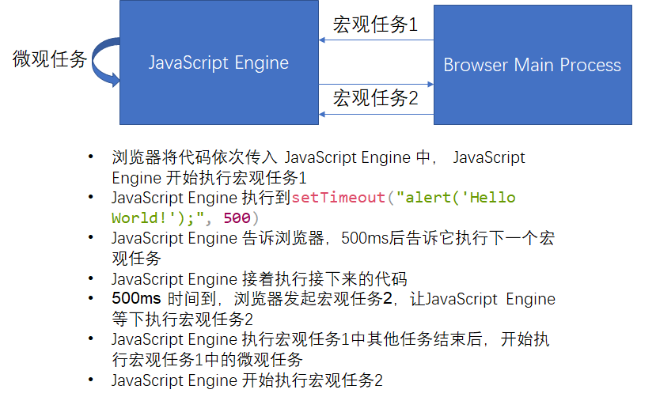

# 宏观任务和微观任务

当拿到一段 JavaScript 代码时，浏览器或者 Node 环境首先要做的就是；传递给 JavaScript 引擎，并且要求它去执行。JavaScript 引擎的执行的任务主要包括：

- 宏观任务：在 ES3 和更早的版本中，JavaScript 没有异步执行代码的能力，宿主环境(node 或浏览器)传递给 JavaScript 引擎一段代码，引擎就执行，这个引擎执行的任务是宿主任务，也就是宏观任务。

- 微观任务：在 ES5 之后，JavaScript 引入了 Promise，意味着引擎本身也可以发起任务，也就是微观任务。

先来看一段 ES5 之后的代码：

```javascript
console.log("1");
setTimeout("alert('Hello World');", 500);
console.log("2");
// '1'
// '2'
// alert: 'Hello World'
```

以上代码输出的解释见下图：



JavaScript 引擎等待宿主环境分配宏观任务，也就是事件循环。可以大概理解为**事件循环就是宏观任务的队列**。事件循环是跑在独立线程中的循环，伪代码为

```javascript
while (TRUE) {
  r = wait();
  execute(r);
}
```

引入 Promise 后，在宏观任务中，**JavaScript 的 Promise 还会产生异步代码，也就是微观任务。JavaScript 必须保证这些异步代码在这一个宏观任务中完成**，因此，**每个宏观任务中又包含了一个微观任务队列。**

有了宏观任务和微观任务机制，我们就可以实现 JavaScript 引擎级和宿主级的任务了。

> Promise 永远在宏观任务队列尾部添加微观任务，所以微观任务始终在下一个宏观任务之前执行。`setTimeout()` 等宿主 API，则会添加宏观任务。

## Promise

宏观任务中的 Promise 会产生异步代码，也就是说， Promise 会产生微观任务。JavaScript 必须保证这些异步代码在这个宏观任务中完成。Promise 的 then 就是 Promise 产生的微观任务，是异步回调。

```javascript
var r = new Promise(function (resolve, reject) {
  console.log("a");
  resolve();
});
r.then(() => console.log("c"));
console.log("b");
```

输出为:

```text
a
b
c
```

上面的例子中，

1. 先执行 Promise，并使 Promise resolved
2. 接着执行到 then，添加微观任务
3. 接着执行`console.log("b");`
4. 最后执行微观任务

## 宏观任务和微观任务执行顺序总结

1. 分析有多少宏观任务
2. 分析每个宏观任务中的微观任务
3. 根据调用次序，确定宏观任务中的微观任务执行次序
4. 根据宏观任务的触发规则和调用次序，确定宏观任务的执行次序
5. 确定整个执行顺序

举个简单的例子：

```javascript
// 5. 在第二个宏观任务中。
setTimeout(() => console.log("d"), 0);

// 1. 在第一个宏观任务中。
var r1 = new Promise(function (resolve, reject) {
  resolve();
});

// 2. 在第一个宏观任务中。使用 Promise.then() 添加一个微观任务。这个微观任务在第一次宏观任务内完成。因为在第一个宏观任务中已经没有其他任务了，所以开始执行微观任务。
r.then(() => {
  var begin = Date.now();
  while (Date.now() - begin < 1000);
  console.log("c1");

  // 3. 在第一个宏观任务中。使用 Promise.then() 再次添加一个微观任务。
  new Promise(function (resolve, reject) {
    resolve();
  }).then(() => console.log("c2")); // 4. 在第一个宏观任务中。由于在第一个宏观任务中没有其他任务了，开始执行这个微观任务。
});
```

输出为：

```text
c1
c2
d
```

我们再来看一个稍微复杂点的例子：

```javascript
function sleep(duration) {
  return new Promise(function (resolve, reject) {
    console.log("b");
    setTimeout(resolve, duration);
  });
}
console.log("a");
sleep(5000).then(() => console.log("c"));
```

输出为：

```text
a
b
c
```

上面的代码被`setTimeout`分为两个宏观任务：

- 宏观任务 1:

  1. 先定义了 sleep 函数
  2. 执行 `console.log("a");`
  3. 执行 `sleep(5000)` ，进入 sleep 函数
  4. 执行 `console.log("b");` 之后，碰到 `setTimeout` 函数，开始下一个宏观任务

- 宏观任务 2:

  1. 执行 `resolve`
  2. 执行 `then` 中的语句

## async/await

ES2016 在 Promise 的基础上引入了`async/await`，有效得改变了代码结构，代码更有可读性。

**在 function 函数前加 async 表示这个函数总是返回一个 Promise,也就是说这个函数变成了异步函数**。

**await 只能用在 async 的函数中**，表示在异步函数中调用了另一个异步函数，等待 await 之后的函数返回结果之后，执行剩下的语句。

`generator/iterator` 并非异步代码，只是在缺少 `async/await` 的时候，一些框架（最著名的要数 `co`）使用这样的特性来模拟 `async/await`。有了 `async/await` 之后，`generator/iterator` 来模拟异步的方法应该被废弃。

### 有 await 的例子

```javascript
function sleep(duration) {
  return new Promise(function (resolve, reject) {
    setTimeout(resolve, duration);
  });
}

async function foo() {
  console.log("a");
  await sleep(2000); // 等待sleep。有了返回结果后，接着执行下面的代码
  console.log("b");
}
foo();
console.log("hello");
```

输出为：

```text
a
hello
b
```

上面的代码理解为：

1. 定义 sleep 和 foo 函数。其中，foo 是异步执行函数。
2. 宏观任务 1 中
   1. 执行 `foo()`
   2. 执行 `console.log("a");`
   3. 执行 `sleep` ，碰到 `setTimeout` ,之后的任务在下一个宏观任务中执行
   4. 由于 `sleep` 前有 `await` ， `foo` 中剩余的 `console.log("b");` 在下一个宏观任务中执行
   5. 跳出 `foo` ，执行 `console.log("hello");`
3. 宏观任务 2 中
   1. 执行 `resolve`
   2. 执行 `console.log("b");`

### 无 await 的例子

```javascript
function sleep(duration) {
  return new Promise(function (resolve, reject) {
    setTimeout(resolve, duration);
  });
}

async function foo() {
  console.log("a");
  sleep(2000);
  console.log("b");
}
foo();
console.log("hello");
```

输出为：

```text
a
b
hello
```

上面的代码理解为：

1. 定义 sleep 和 foo 函数。其中，foo 是异步执行函数。
2. 宏观任务 1 中
   1. 执行 `foo()`
   2. 执行 `console.log("a");`
   3. 执行 `sleep` ，碰到 `setTimeout` ,之后的任务在下一个宏观任务中执行
   4. 由于 `sleep` 前没有 `await` ，继续执行 `console.log("b");`
   5. 跳出 `foo` ，执行 `console.log("hello");`
3. 宏观任务 2 中
   1. 执行 `resolve`
