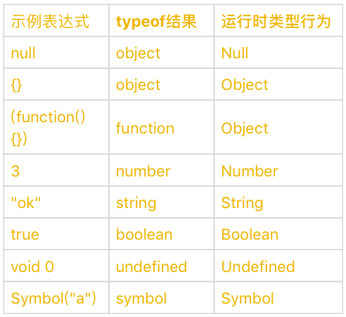

# 类型

运行时类型是指代码实际执行过程中我们用到的类型。从变量、参数、返回值到表达式中间结果，任何 JavaScript 代码运行过程中产生的数据都具有运行时类型。

## 七种数据类型

JavaScript 有七种数据类型，其中除了 `Object`，其余都是基本数据类型。

### Undefined

Undefined 类型只有一个值，那就是 `undefined`。任何变量在赋值之前，变量类型就是 Undefined，值是 `undefined`。

以前的代码里中，经常能看到在 `<a>` 标签上使用 JavaScript 代码：

```html
<script>
  function openBaidu() {
    window.open("http://www.baidu.com");
  }
</script>

<!-- 代码为 undefiend，所以该标签不进行任何跳转。 -->
<a href="javascript: void(0)">Stay here!</a>

<!-- 代码为 openBaidu()，执行跳转 -->
<a href="javascript:openBaidu()">Go to Baidu</a>
```

在旧的浏览器中，由于 JavaScript 的设计缺陷，`undefined` 是一个变量，而不是一个关键字，也就是说 `undefined` 可以被覆盖。为了弥补这个缺陷，引入 `void`。`void` 是一种操作符，作用是执行 `void` 之后的代码并会返回 `undefined`。所以，为了向前兼容，一般用 `void 0` 得到 `undefined`。

在新的浏览器中，可以直接使用 undefined。

```javascript
void 0 == undefined; // true
```

### Null

Null 类型只有一个值，那就是 `null`。Null 类型表示“定义并赋值了，但是值为空”。

### Boolean

Boolean 类型只有两个值，那就是 `true/false`。

### String

JavaScript 中的字符串(也就是 String 类型的值)是永远无法变更的，一旦字符串构造出来，无法用任何方式改变字符串的内容。所以字符串具有值类型的特征。

在 JavaScript 中，使用 UTF-16 编码，中文字符/英文字符都用一个 Unicode 字符表示。

String 类型的意义并非是“字符串”，而是字符串的 UTF-16 编码，字符串的操作 `charAt`、`charCodeAt`、`length` 等针对的都是 UTF-16 编码。也就是说，String 类型用于表示零个或多个 16 位 Unicode(UTF-16) 的字符组成的字符序列。

关于字符、字节、位数，可以这么理解：

- 一个字符就是一个单元，占据的存储空间用比特位数表示。
- 一般来说，一个中文字符表示两个字节，一个英文字符表示一个字节。
- 一个字节占据 8 个比特位数。

当中英文字符混杂组成 String 类型，如果计算要字节个数，可以使用：

```javascript
function strLen(str) {
  var count = 0;
  for (var i = 0, len = str.length; i < len; i++) {
    count += str.charCodeAt(i) < 256 ? 1 : 2;
  }
  return count;
}

strLen("hello尤文"); // 9

"hello尤文".length; // 7
```

### Number

JavaScript 中的 Number 类型有 18437736874454810627(即 2^64-2^53+3) 个值，基本符合 IEEE 754-2008 规定的双精度浮点数规则。

```javascript
// 浮点数的不精确性
console.log(0.1 + 0.2 == 0.3); // false

console.log(Math.abs(0.1 + 0.2 - 0.3) <= Number.EPSILON); // true

// 区分 Number 类型和 Number 对象
var a = new Number("123");
a === 123; // false。新建一个Number对象。

var b = Number("123");
b === 123; // true。新建一个Number类型。

a instanceof Number; // is true
b instanceof Number; // is false
```

### Symbol

Symbol 是 ES6 中引入的新类型，它是一切非字符串的对象 key 的集合，在 ES6 规范中，整个对象系统被 Symbol 重塑。

### Object

Object 的定义是“属性的集合”。属性分为**数据属性**和**访问器属性**，二者都是 key-value 结构，key 可以是字符串或者 Symbol 类型。事实上，JavaScript 中的“类”仅仅是运行时对象的一个私有属性，而 JavaScript 中是无法像 Java 那样自定义类型的。

JavaScript 语言设计上试图模糊 Object 和其他基本类型之间的关系，所以 Object 与基本类型存在装箱与拆箱的操作。

## 类型转换


上图中，看的角度是从粉色底类型转换为蓝色底类型。

### StringToNumber 的转换

- `Number()`

  ```javascript
  var n = Number("10");
  n; // 10
  ```

- `parseInt()`

  ```javascript
  var n = parseInt("1111", 2);
  n; // 15
  ```

- `parseFloat()`

  ```javascript
  var n = parseFloat("100.25");
  n; // 100.25
  ```

### NumberToString 的转换

- `toString()`

### 装箱

基本类型 Number、String、Boolean、Symbol 在 Object 类型中都有对应的类。所谓装箱转换，正是把基本类型转换为对应的 Object 类型，它是类型转换中一种相当重要的种类。

### 拆箱

Object 到 String 类型和 Number 类型的转换都遵循“先拆箱再转换”的规则。

拆箱转换会尝试调用 `valueOf()` 和 `toString()` 来获得拆箱后的基本类型。如果 `valueOf()` 和 `toString()` 都不存在，或者没有返回基本类型，则会产生类型错误 TypeError。

```javascript
var o = {
  valueOf: () => {
    console.log("valueOf");
    return {};
  },
  toString: () => {
    console.log("toString");
    return {};
  },
};

o * 2;
// valueOf
// toString
// TypeError
```

在 ES6 之后，还允许对象通过显式指定 @@toPrimitive Symbol 来覆盖原有的行为。

```javascript
var o = {
  valueOf: () => {
    console.log("valueOf");
    return {};
  },
  toString: () => {
    console.log("toString");
    return {};
  },
};

o[Symbol.toPrimitive] = () => {
  console.log("toPrimitive");
  return "hello";
};
console.log(o + "");
// toPrimitive
// hello
```

## `typeof`、`instanceof` 和 `Object.prototype.toString()` 的对比

- 使用 `typeof` 判断属于七种类型中的哪种

  

  由上图可知，typeof 判断类型是有瑕疵的。

  ```javascript
  'example string' instanceof String; // false
  typeof 'example string' === 'string'; // true

  'example string' instanceof Object; // false
  typeof 'example string' === 'object'; // false

  true instanceof Boolean; // false
  typeof true === 'boolean'; // true

  99.99 instanceof Number; // false
  typeof 99.99 === 'number'; // true

  function() {} instanceof Function; // true
  typeof function() {} === 'function'; // true

  typeof null; // object

  ```

- 使用 `instanceof` 判断是否是 Object 类型的实例，涉及到原型链

  ```javascript
  var ClassFirst = function() {};
  var ClassSecond = function() {};
  var instance = new ClassFirst();
  typeof instance; // object
  typeof instance == "ClassFirst"; // false
  instance instanceof Object; // true
  instance instanceof ClassFirst; // true
  instance instanceof ClassSecond; // false

  /regularexpression/ instanceof RegExp; // true
  typeof /regularexpression/; // object

  [] instanceof Array; // true
  typeof []; //object

  {} instanceof Object; // true
  typeof {}; // object
  ```

- 使用 `Object.prototype.toString()` 得到变量是 Object 类型的何种子类型

  在 JavaScript 中，没有任何方法可以更改私有的 Class 属性，因此 `Object.prototype.toString()` 是可以准确识别变量对应的 Object 类型子类型的方法，它比 instanceof 更加准确。但需要注意的是，call 本身会产生装箱操作，所以需要配合 typeof 来区分基本类型还是对象类型

  ```javascript
  Object.prototype.toString.call([1, 2, 3]); //"[object Array]"
  Object.prototype.toString.call(new Date()); //"[object Date]"
  Object.prototype.toString.call(/a-z/); //"[object RegExp]"
  ```
