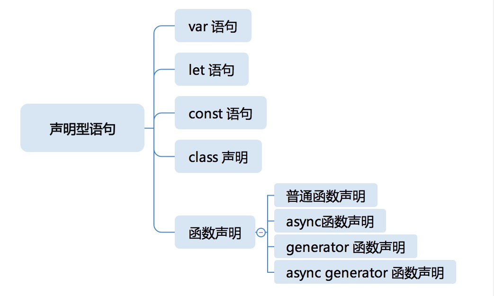

# 语法

## 自动插入分号

JavaScript 语言提供了分号自动补全规则:

- 有换行符，且下一个符号是不符合语法的，那么就尝试插入分号。

  ```text
  let a = 1
  void function(a){
    console.log(a);
  }(a);
  ```

  上面的例子中，由于 1 后面加 void 是不符合语法的，所以会在 void 前尝试插入分号：

  ```text
  let a = 1
  ;void function(a){
  console.log(a);
  }(a);
  ```

- 有换行符，且语法中规定此处不能有换行符(no LineTerminator here 规则)，那么就在该换行符处自动插入分号。

  

  ```text
  var a = 1, b = 1, c = 1;
  a
  ++
  b
  ++
  c

  ```

  在上面这个例子中，a 后面有换行符，而后自增前是不能有换行符的，所以在 a 后面自动插入分号，最后的结果是：

  ```text
  var a = 1, b = 1, c = 1;
  a;
  ++
  b;
  ++
  c;
  ```

- 源代码结束处，不能形成完整的脚本或者模块结构，那么就自动插入分号。

关于写代码时候要不要写分号，根据项目的代码规范而定，可以使用 eslint/prettier 等工具进行自动化。尤雨溪曾经在知乎说：真正会导致上下行解析出问题的 token 有 5 种：以括号，方括号，正则开头的斜杠，加号，减号为行首。我还从没见过实际代码中用正则、加号、减号作为行首的情况，所以总结下来就是一句话：

> 一行行首是括号或者方括号的时候加上分号就可以了，其他时候全部不需要。

## 指令序言机制

指令序言机制规定了一种给 JavaScript 代码添加元信息的方式。

`"use strict"` 是 JavaScript 标准中规定的唯一一种指令序言。但是设计指令序言的目的是留给 JavaScript 的引擎和实现者一些统一的表达方式，在静态扫描时可以指定 JavaScript 代码的一些特性。

```javascript
// 输出 null
"use strict";
function f() {
  console.log(this);
}
f.call(null);

// 输出 global
function f() {
  console.log(this);
}
f.call(null);
```

除了`"use strict"`之外，常见的还有 lint 检查指令。比如 eslint 中的 `/* eslint-disable */` 放在文件首行，表示该文件不进行 lint 检查。

## 脚本和模块


JavaScript 有两种源文件，一种叫做脚本，一种叫做模块。**无论引入哪种，脚本或模块里的代码都会先执行一遍。**

- 脚本：可以用浏览器或 node 环境引入执行的，我们可以认为脚本具有主动性的 JavaScript 代码段，是控制宿主完成一定任务的代码。
- 模块：只能由 JavaScript 代码通过 import 引入执行。模块是被动性的 JavaScript 代码段，是等待被调用的库。

现代浏览器可以支持用 script 标签引入模块或者脚本。如果要引入模块，必须给 script 标签添加 `type="module"`。如果引入脚本，则不需要 type:

```html
<!-- 引入脚本 -->
<script src="xxxxx.js"></script>

<!-- 引入模块 -->
<script type="module" src="yyyyy.js"></script>
```

## 函数体

宏观任务中可能会执行的代码包括 `脚本 (script)` `模块（module）` 和 `函数体（function body）`。

```javascript
setTimeout(function () {
  console.log("go go go");
}, 10000);
```

上面的代码表示在宿主环境(浏览器或 node 等)中注册一个函数，当一定时间后，宿主执行这个函数，也就是宿主告知 JavaScript 引擎时间到了，开启下一个宏观任务，JavaScript 引擎要执行的代码就是函数体。

**函数体其实也是一个语句的列表**。跟脚本和模块比起来，函数体中的语句列表中多了 return 语句可以用。函数体主要分为：

- 普通函数体

  ```javascript
  function foo() {
    //Function body
  }
  ```

- 异步函数体

  ```javascript
  async function foo() {
    //Function body
  }
  ```

- 生成器函数体

  ```javascript
  function* foo() {
    //Function body
  }
  ```

- 异步生成器函数体

  ```javascript
  async function* foo() {
    //Function body
  }
  ```

各种函数体的区别主要是：


以上，"✔"表示可以使用，"×"表示不能使用。

## 语句

JavaScript 语句主要分为声明型语句和普通语句。声明型语句有**预处理过程**，普通语句只有执行过程。

### 声明型语句



JavaScript 在执行前，会对模块/脚本/函数体中的语句进行**预处理**，变量提升就是其中一个比较重要的点。

#### var 声明

var 声明永远作用于脚本、模块和函数体这个级别。在预处理阶段，不关心赋值的部分，只管在当前作用域声明这个变量。

```javascript
var a = 1;

function foo() {
  console.log(a);
  var a = 2;
}

foo();
/*
undefined
*/
```

var 会穿透一切语句，比如穿透 if 语句:

```javascript
var a = 1;

function foo() {
  console.log(a);
  if (false) {
    var a = 2;
  }
}

foo();
/* 输出
undefined
*/
```

**大部分情况下，var 声明可以用 let 或 const 声明替代**。如果实在想用，可遵循:

1. 声明同时必定初始化
2. 尽可能在离使用位置近的地方声明
3. 不要在意重复声明

#### function 声明

在全局（脚本、模块和函数体）情况下，function 声明表现跟 var 相似，**不同之处在于，function 声明不但在作用域中加入变量，还会给它赋值**。

```javascript
console.log(foo);
function foo() {}
/* 输出
function foo() {}
*/
```

function 声明出现在 if 等语句中的情况有点复杂，它仍然作用于脚本、模块和函数体级别，在预处理阶段，仍然会产生变量，但它不再被提前赋值：

```javascript
console.log(foo);
if (true) {
  function foo() {}
}
/* 输出
undefined
*/
```

#### class 声明

```javascript
var c = 1;
function foo() {
  console.log(c);
  class c {}
}
foo();
/* 输出
抛出错误
*/
```

这说明，class 声明也是会被预处理的，它会在作用域中创建变量，并且要求访问它时抛出错误。

class 的声明作用不会穿透 if 等语句结构，所以只有写在全局环境才会有声明作用。

class 内部，可以使用 constructor 关键字来定义构造函数。还能定义 getter/setter 和方法。需要注意，class 默认内部的函数定义都是 `use strict` 模式的。

```javascript
class Rectangle {
  constructor(height, width) {
    this.height = height;
    this.width = width;
  }
  // Getter
  get area() {
    return this.calcArea();
  }
  // Method
  calcArea() {
    return this.height * this.width;
  }
}
```

#### let 和 const 声明

let/const 和 class 有点像，也是会被预处理的，它会在作用域中创建变量，并且要求访问它时抛出错误。

```javascript
var c = 1;
function foo() {
  console.log(c);
  let c = 100;
}
foo();
/* 输出
抛出错误
*/
```

let 和 const 的作用范围是 if、for 等结构型语句。

### 普通语句


#### 语句块

语句块就是一对大括号。

```javascript
{
  var x, y;
  x = 10;
  y = 20;
}
```

#### 空语句

空语句就是一个独立的分号。从语言完备性来说，允许空语句使得插入多个分号不报错。

```text
;
```

#### if 语句

```javascript
if (a < 10) {
  //...
} else if (a < 20) {
  //...
} else {
  //...
}
```

#### switch 语句

```javascript
switch(num) {
  case 1:
      print 1;
      break;
  case 2:
      print 2;
      break;
  case 3:
      print 3;
      break;
  default:
    break;
}
```

#### 循环语句

```javascript
// while
let a = 100;
while (a--) {
  console.log("*");
}
```

```javascript
// do while
let a = 101;
do {
  console.log(a);
} while (a < 100);
```

```javascript
// for: 普通 for 循环
for (i = 0; i < 100; i++) console.log(i);
for (var i = 0; i < 100; i++) console.log(i);
for (let i = 0; i < 100; i++) console.log(i);

var j = 0;
for (const i = 0; j < 100; j++) console.log(i);
```

```javascript
// for in: 循环对象的可枚举属性
let o = { a: 10, b: 20 };
Object.defineProperty(o, "c", { enumerable: false, value: 30 });
for (let p in o) console.log(p);
// a
// b
```

```javascript
// for of: 得到对象的 iterator 属性的 next 函数返回的值中的 value
for (let e of [1, 2, 3, 4, 5]) console.log(e);

// 方法一：定义对象的 iterator 属性
let o = {
  [Symbol.iterator]: () => ({
    _value: 0,
    next() {
      if (this._value == 10)
        return {
          done: true,
        };
      else
        return {
          value: this._value++,
          done: false,
        };
    },
  }),
};
for (let e of o) console.log(e);

// 方法二：使用generator
function* foo() {
  yield 0;
  yield 1;
  yield 2;
  yield 3;
}
for (let e of foo()) console.log(e);
```

```javascript
// for await of
function sleep(duration) {
  return new Promise(function (resolve, reject) {
    setTimeout(resolve, duration);
  });
}
async function* foo() {
  i = 0;
  while (true) {
    await sleep(1000);
    yield i++;
  }
}
for await (let e of foo()) console.log(e);
```

#### return 语句

return 语句终止函数的执行，并指定函数的返回值。

```javascript
function squre(x) {
  return x * x;
}
```

#### break 语句和 continue 语句

break 语句用于跳出循环语句或者 switch 语句，continue 语句用于结束本次循环并继续循环。

#### with 语句

with 语句会改变当前的作用域，**不推荐使用**。

```javascript
let o = { a: 1, b: 2 };
with (o) {
  console.log(a, b);
}
```

#### 异常处理语句

throw 抛出异常，try 捕获异常代码段，catch 用于处理异常，finally 用于清理。

```javascript
try {
  throw new Error("error");
} catch (e) {
  console.log(e);
} finally {
  console.log("finally");
}
```

#### debugger 语句

debugger 语句用于调试，通知调试器在此断点。

#### 表达式语句

JavaScript 中，真正起作用的是表达式语句，其他语句只是产生各种结构，来控制表达式语句的执行。

表达式语句实际上就是一个表达式，是由运算符连接变量或者直接量构成的。

实际应用中，表达式语句的主要用途包括：

- 函数调用
- 赋值
- 自增/自减

因为只有这样才使表达式语句计算的结果有意义。但是从语法层面来说，并没有这样的限制。

下面按照颗粒度由小到大介绍。

##### Primary Expression 主要表达式

Primary Expression 是**表达式的最小单位**，优先级最高。可以包括：

- 字面量

  ```javascript
  "abc";
  123;
  null;
  true;
  false;

  // 由于 {、function、class 与声明语句有语法冲突，所以使用括号
  ({});
  (function () {});
  (class {});
  [];
  /abc/g;
  ```

- this
- 变量
- 任何表达式加上`()`,就会变成 Primary Expression

##### Member Expression 成员表达式

通常用于访问对象成员。

```javascript
a.b;
a["b"];
new.target;
super.b;
```

new.target 是刚引入的语法，用于判断是否是被 new 调用的。

```javascript
function Foo() {
  if (!new.target) throw "Foo() must be called with new";
}

try {
  Foo();
} catch (e) {
  console.log(e);
  // expected output: "Foo() must be called with new"
}
```

另外，以下两种语法与 Member Expression 相同优先级：

```javscript
f`a${b}c`; // 表示模板计算后的值传递给函数
new Cls(); // 带参数列表的 new 表达式
```

Member Expression 可以构成 New Expression 和 Call Expression

##### New Expression

指没有参数列表的 new 表达式。比如 `new new Cls(1);`等价于`new (new Cls(1));`

```text
class Cls {
  constructor(n) {
    console.log("cls", n);
    return class {
      constructor(n) {
        console.log("returned", n);
      }
    };
  }
}

new new Cls(1);
```

得到的结果是

```text
cls 1
returned undefined
```

相当于第二个 new 没有传入参数。

##### Call Expression 函数调用表达式

Call Expression 是 Member Expression 后加一个括号里的参数列表。

```javascript
a.b(c); // 相当于取到a.b这个属性，然后执行这个属性
super();
```

##### Left Hand Side Expression 左值表达式

左值表达式就是可以放在等号左边的表达式。New Expression 和 Call Expression 都属于左值表达式。

```javascript
a().c = b;
```

##### Assignment Expression 赋值表达式

赋值表达式就是使用等号的表达式。除了等号，还有`*=、/=、%=、+=、-=、<<=、>>=、>>>=、&=、^=、|=、**=`

```javascript
a = b;
```

##### Expression 表达式

Assignment Expression 可以构成 Expression 的一部分。Expression 就是用逗号运算符连接的赋值表达式。整个表达式的结果”就是“最后一个逗号后的表达式结果”。

```javascript
(a = b), (b = 1), null;
```

##### Update Expression 更新表达式

```javascript
++a;
a++;
--b;
b--;
```

##### Unary Expression 一元运算表达式

搭配一元运算符，就构成了 Unary Expression

```javascript
delete a.b;
void a;
typeof a;
-a;
~a;
!a;
await a;
```

##### Exponentiation Expression 乘方表达式

乘方表达式。`**`运算是右结合的。

```text
(++i) ** 30;
2 ** 3 // 8; 正确
-2 ** 30; // 报错
```

##### Multiplication Expression 乘法表达式

乘法表达式，用乘号、除号、取余号即可表示。

```javascript
*
/
%
```

##### Additive Expression 加法表达式

加法表达式是由乘法表达式用加号或减号连接构成的。

```javascript
a + b * c;
a - b * c;
```

##### Shift Expression 移位表达式

移位表达式由加法表达式构成。

```javascript
<<n: 向左移位，表示乘以2的n次方
>> 向右移位
>>> 无符号向右移位
```

##### Relational Expression 关系表达式

关系表达式常用于判断两个类型之间的关系。

```javascript
<=
>=
<
>
instanceof
in
```

##### Equality Expression 相等表达式

相等表达式用于判断是否相等。

```javascript
==
===
!=
!==
```

##### Bitewise Expression 位运算表达式

位运算表达式主要有

- 按位与
- 按位或
- 按位异或

```javascript
^
&
|
```

##### Logical Expression 逻辑表达式

```javascript
&&
||
```

##### Conditional Expression 条件表达式

```javascript
condition ? branch1 : branch2;
```
